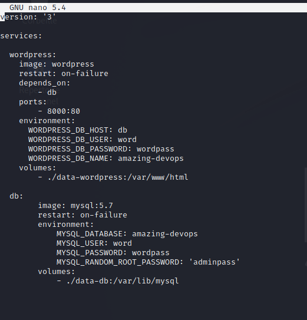
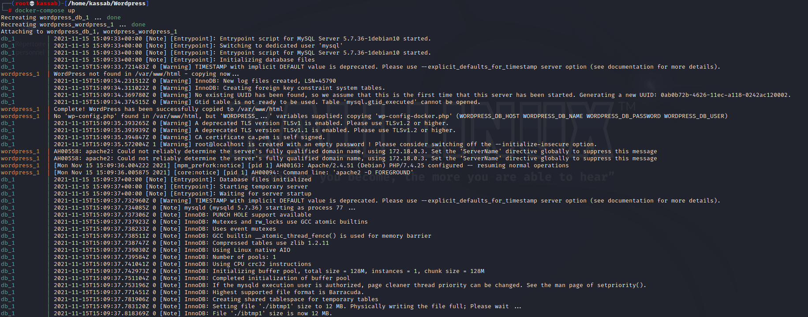
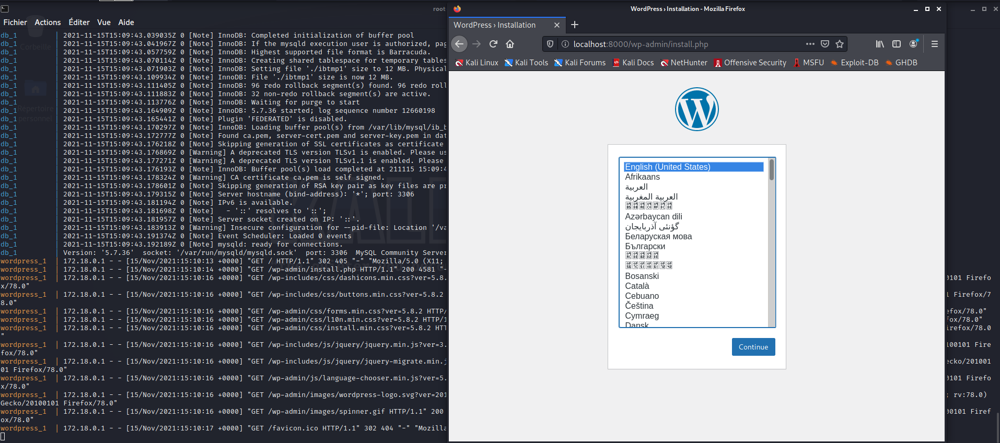
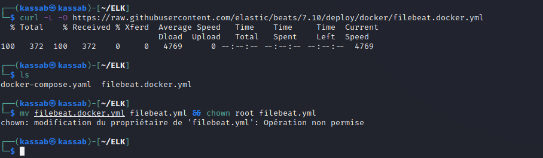
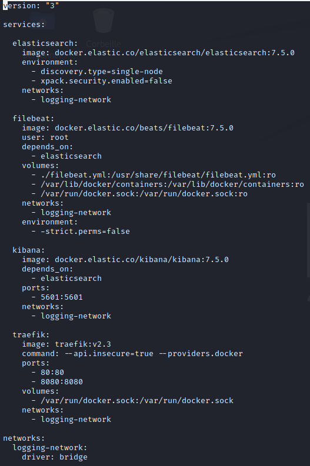
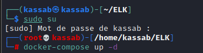
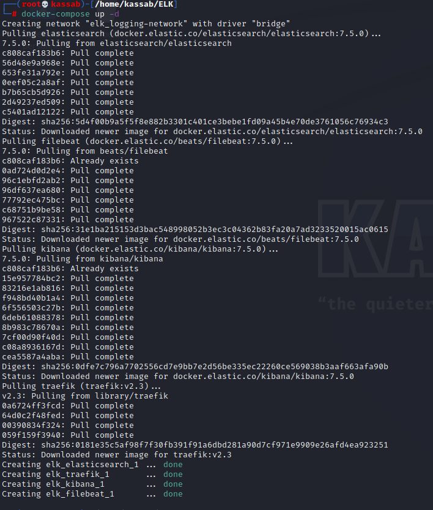
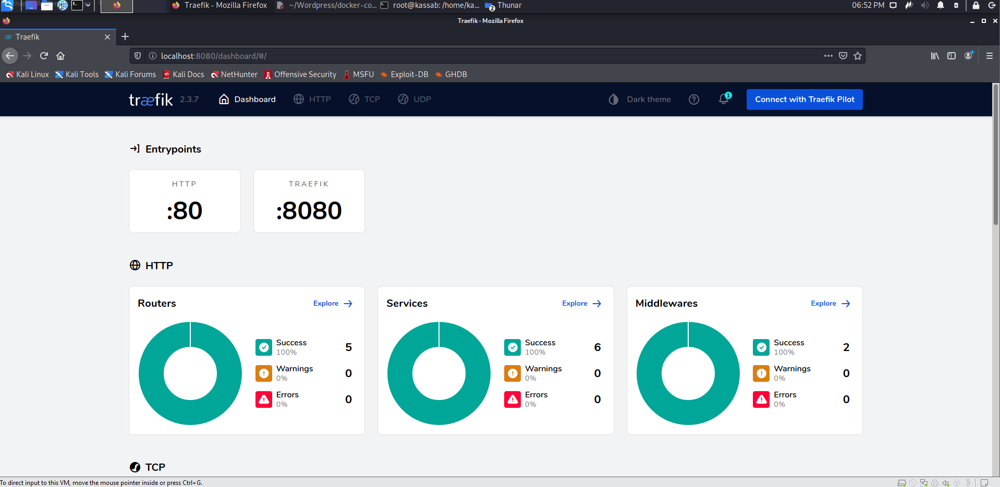

# B3 TP [KASSAB_JOHN]

## Exercice 1 : Wordpress

On crée notre fichier `docker-compose.yaml` et le complète avec les informations requises. Dans notre cas, nous pouvons récupérer une template de celui ci à cette adresse : https://hub.docker.com/_/wordpress

On choisit la version de docker-compose au tout début (qui est importante étant donné que la syntaxe change d'une version à une autre)

On définit donc nos 2 services `wordpress` et `db`

Pour *Wordpress*, on lui définit 
- une image (Wordpress)
- le type de redémarrage (redémarrage automatiquement en cas de crash)
- qui dépend donc de notre db
- le port (ici 8000)
- les variables d'environnement
- le volume (copie hôte/container)

Pour *MySql*, on lui définit 
- une image (MySql:5.7)
- le type de redémarrage (redémarrage automatiquement en cas de crash)
- les variables d'environnement
- le volume (copie hôte/container)

Pour ce qui s'agit des volumes

`docker-compuse up` exécute les différents services présents dans le **docker-compose.yaml**

On accède à *localhost:8000* (port que l'on a prédéfini auparavant). Le service tourne correctement. Si tout se passe bien on peut donc accéder à notre Wordpress

---

## Exercice 1 : ELK

On recupère la configuration Filebeat grâce à `curl -L -O https://raw.githubusercontent.com/elastic/beats/7.10/deploy/docker/filebeat.docker.yml`

On exécute cette commande : `mv filebeat.docker.yml filebeat.yml && chown root filebeat.yml` qui va permettre de modifier le nom du fichier et de nous donner les droits d'exécution sur le fichier *yaml*

On rajoute au docker-compose existant le service traefik avec une image traefik en version 2.3 et une redirection sur les ports 80 et 8000

Le fichier docker.sock est le socket UNIX que le démon Docker écoute. C'est le principal point d'entrée de l'API Docker.

On exécute notre fichier docker-compose avec un `up -d` pour que le service tourne en background

On peut désormais accéder en local via le port 8080 à notre service traefik

